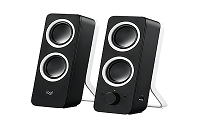

# My Remote Working Setup
I got asked this a bit, so documenting for reference.

My hobby is photography, so I know about lighting and how cameras work; I've also done a bit of audio work (engineering, roadie, mixing, etc) so have tried to use this knowledge to get the most out of a modicum of investment.

I came up with this set up over a couple of months. I started back in April, when I realised Covid-normal was going to be here for the rest of 2020 and I wanted something better than a laptop with a headset.
 
Please also see the Issues section below.

Screens are 27 inch for reference.
 
 
# Requirements
- No headphones; I got tired/headaches after 6 hours continuous MyMeetings
- Big screen real-estate
- Flexible for work/home reconfiguration
- Ergonomic
- Good quality for me (hearing them)
- Good quality for others (hearing/seeing me)
- Works without drivers or other software (my corporate laptop is locked down).
 
# Audio
I really wanted speakers as opposed to headphones. This gives better spatial audio quality and means I'm not struggling with cords or constantly putting on and off headphones.

## Microphone
https://www.rode.com/microphones/nt-usb_mini

This is an Australian company; this mic does not require a mixer/amplifier/phantom power, it's a simple USB connection. 
- It has a built in pop filter. This is super important.
- Small and compact.
- I fit it on a cheap boom arm ($25) from Amazon. You can spend more if you wish. This also frees up desk space and allows typing at the same time.
 
### Recommendations:
- get as close as possible. closer.
- try to place is so as not to breathe directly into it, slightly off the side (higher is ok, but blocks your face for video)
- a decent mic will only pick up sound directly in front. Adjust the audio for this and leave it be. Background noise shouldn't be an issue if the level is set for a few centimetres.
- Having a boom arm is important to avoid vibrations and tapping noise from the desk.

## Speakers
https://www.logitech.com/en-au/product/multimedia-speakers-z200?crid=47

Good performers; these are taped lying down to fit underneath the monitors.
- Volume control, so I don't need to find and adjust from the little icon in the taskbar. Much easier
- has a second input. You'll note a little green cable that connects from my laptop. This means I get Spotify from my home PC and audio from work at the same time!
 
# Video

## Webcam
https://www.logitech.com/en-au/product/c922-pro-stream-webcam
There is a LOT to say here, a lot of options.

 
- It's a 1080p camera; although we only ever use 360/720 for conferences. This gives you the ability to zoom in a bit closer without loosing quality/definition on a 720p call.
- Reasonable dynamic range
- It does have a microphone which can be used, but will make you sound rather 'empty'
- No drivers - but see issues on setup with Teams.
 
***Camera must not be backlit***. Webcams are just too low quality to deal with light coming directly onto the lens. Ergo 
- Don't sit with a window behind you or just to the side
- Overhead lights also play havoc, avoid any ceiling light being in-shot. ***I taped a piece of paper over my light so as to limit glare from overhead.***

Think of camera placement 
- Don't want to look up your nose.
- Wide angle is not flattering. Your face should fill most of the frame (especially when there are multiple participants in a group chat)
- Best camera placement: just above eye height, slightly facing down.
- Preferable to have camera directly facing you; consider where your video will show up, so you look at that just below the camera for best effect.
- If you can't get an external webcam, please please please use a laptop stand or similar.
- Also not a good idea to have a camera that moves (laptop screen, iphone, etc). Just nauseating 

Background: 
- The "blur" in Teams doesn't work well. It is more distracting than anything else. I use dedicated software, but this only works on my home PC.
- I go more for a darker background. I have a light in the background ("practical light") just to add some ambience/visuals. It doesn't affect the level of light at all.
 
### Camera Configuration
***The camera does not save settings.*** Each time it is plugged in to a new computer or rebooted, it needs to be configured. Only takes a few seconds though.
          
- Turn off Auto-Focus and Whitebalance - this speeds up the camera (yeah, I know)
- Adjust whitebalance
- Zoom until you are nicely in frame
- Increase the Sharpness somewhat

## Monitor(s)
To gain desk space, I've relegated my laptop screen and use a (semi) dedicated monitor. Both  are 27 inch Dells. The right runs my home PC 100%, the left is used for work during the day and as the second monitor for the home PC otherwise.
- All are permanently wired; both monitors come with an input switch.
- The monitors are also hubs. See below on Integration.
- Camera sits on the monitor; thinking about getting a mounting option.

## Lighting

https://www.amazon.com.au/Neewer-Packs-Dimmable-Bi-Color-Lighting/dp/B072Q42GXQ (just for reference, you can get them fairly cheap if you look around)

I'm using two lights. Both are cheap Chinese brand lights on desk stands. Run off 240v, no batteries to mess with.
- Softbox is the main light, provides nice gentle lighting.
- Light on the right is the fill-light. 
- Adjustable temperature (think colour, daylight, sunset, harsh, etc)
- Lights are off until I use them.
 
You'll also note that I have a reasonably big window in front of me. This does provide good light (bushes/trees block direct, harsh light). The lights provide consistency and depth, as well as evening calls.
I've also covered some side windows with a sheet, because the light was too strong there.

# Integration

I only have one cable to switch!

Monitors are USB hubs; 
- on the left monitor I run my laptop's external keyboard and mouse
- on the right, I have the microphone and camera; this is the cable I switch (in red in the diagram) if I want to use my home PC for video conference (much preferred)

Both laptop and PC are connected to speakers, but this does mean the volume knob controls both, not independently.

On the diagram, the red line represents the USB cable that I switch between computers to move the camera/mic. This means I don't need to move/rewire both of them every time I need to change.

# Issues
- Cameras are usually driver-less - but need to be configured/setup every time you reboot or reconnect them. There is software, but we can't install this 
- On my home PC I use software to control the camera and blur/replace background image. This works MUCH better than the stuff in teams, but can't be run on our laptops due to restrictions. Worth investigating if you do more than work calls.
- Mechanical keyboard does make some noise, but is soooo good  
